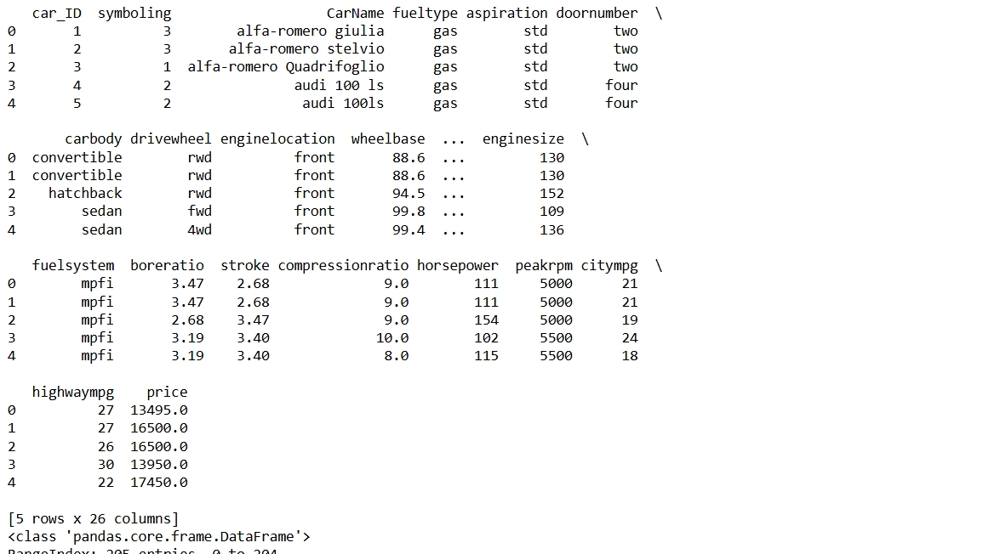
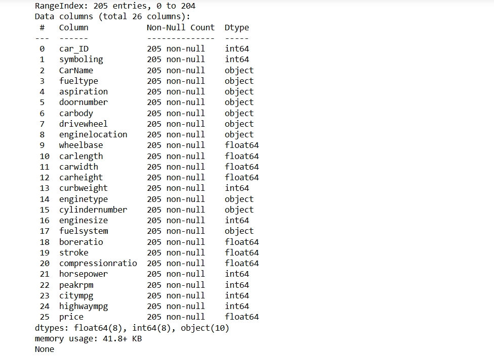
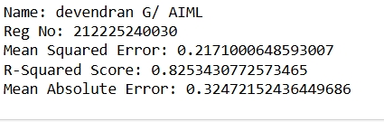
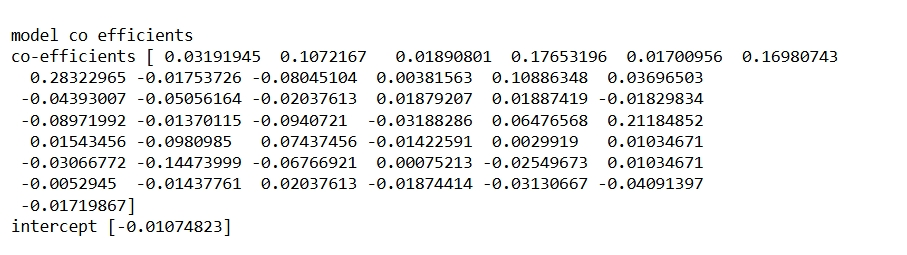
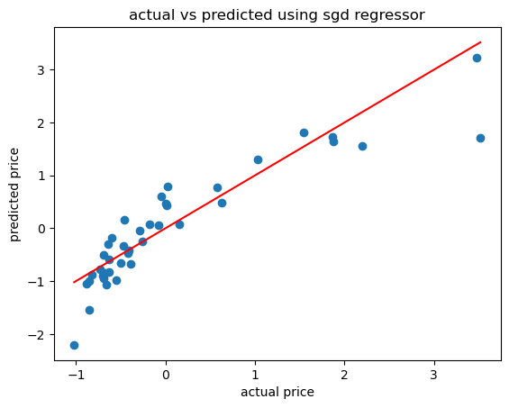

# BLENDED_LEARNING
# Implementation-of-Stochastic-Gradient-Descent-SGD-Regressor

## AIM:
To write a program to implement Stochastic Gradient Descent (SGD) Regressor for linear regression and evaluate its performance.

## Equipments Required:
1. Hardware – PCs
2. Anaconda – Python 3.7 Installation / Jupyter notebook

## Algorithm
 1.Import the necessary libraries. 

 2.Load the dataset.

 3.Preprocess the data (handle missing values, encode categorical variables).

 4.Split the data into features (X) and target (y).
  
 5.Divide the data into training and testing sets.

 6.Create an SGD Regressor model.

 7.Fit the model on the training data.

 8.Evaluate the model performance. 
 
 9.Make predictions and visualize the results.

## Program:
```
/*
Program to implement SGD Regressor for linear regression.
Developed by: DEVENDRAN G
RegisterNumber:  212225240030

import pandas as pd
import numpy as np
from sklearn.model_selection import train_test_split
from sklearn.linear_model import SGDRegressor
from sklearn.metrics import mean_squared_error,r2_score,mean_absolute_error
from sklearn.preprocessing import StandardScaler
import matplotlib.pyplot as plt

#Load the dataset
data=pd.read_csv('CarPrice_Assignment.csv') 
print(data.head())
print(data.info())

#data preprocessing
#dropping unnecessary columns and handling categorical variables
data = data.drop(['CarName','car_ID'],axis=1)
data =pd.get_dummies(data, drop_first=True)

# Splitting the data features and target variable
x = data.drop('price',axis=1)
y = data['price']

# standardizing the data
scaler = StandardScaler()
x= scaler.fit_transform(x)
y = scaler.fit_transform(np.array(y).reshape(-1,1))

#splitting the data set into training and testing sets
x_train,x_test,y_train,y_test=train_test_split(x,y,test_size=0.2,random_state=42)

#creating the SGD Regressor model
sgd_model = SGDRegressor(max_iter=1000, tol=1e-3)

#Fitting the model on the training model
sgd_model.fit(x_train,y_train)

#making prediction
y_pred = sgd_model.predict(x_test)

# Evaluated model performance
mse = mean_squared_error(y_test,y_pred)
r2=r2_score(y_test,y_pred)
mae=mean_absolute_error(y_test,y_pred)

#print evaluation metrics
print('Name: devendran G/ AIML')
print('Reg No: 212225240030')
print('Mean Squared Error:',mse)
print('R-Squared Score:',r2)
print('Mean Absolute Error:',mae)

#print model coefficient
print("\nmodel co efficients")
print("co-efficients",sgd_model.coef_)
print("intercept",sgd_model.intercept_)

#visualisation actual vs predicted prices
plt.scatter(y_test,y_pred)
plt.xlabel("actual price")
plt.ylabel("predicted price")
plt.title("actual vs predicted using sgd regressor")
plt.plot([min(y_test),max(y_test)], [min(y_test),max(y_test)],color='red')
plt.show()

*/
```

## Output:






## Result:
Thus, the implementation of Stochastic Gradient Descent (SGD) Regressor for linear regression has been successfully demonstrated and verified using Python programming.
